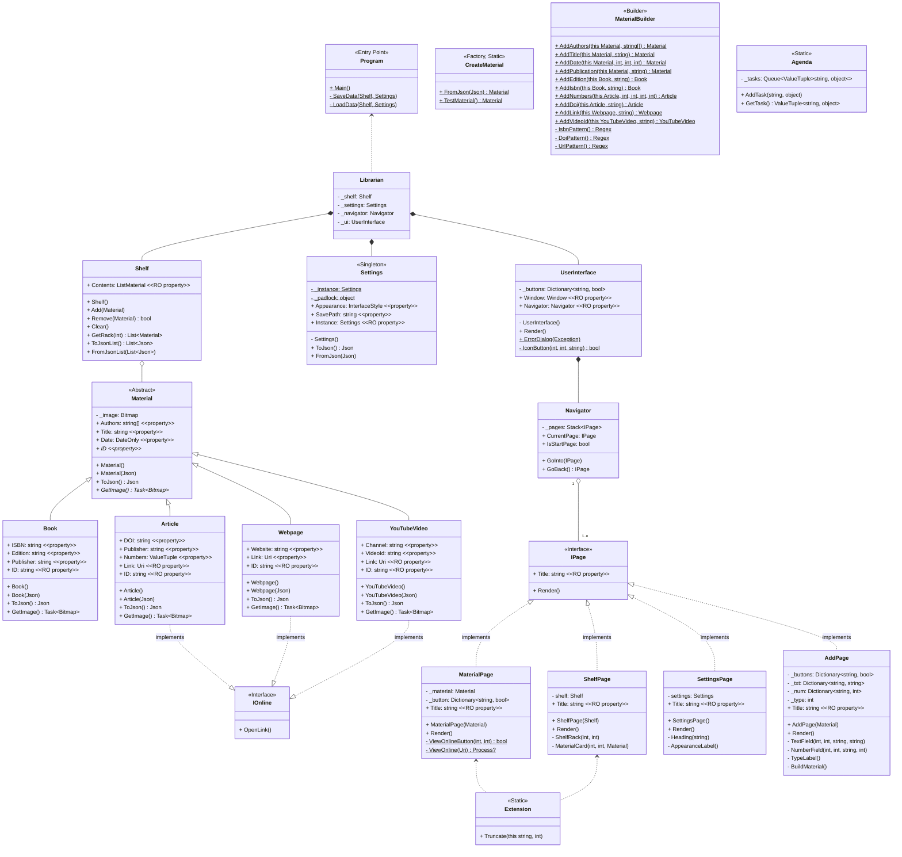

# UML Class Diagram

```mermaid
classDiagram
direction TB

Program <.. Librarian
Librarian *-- Shelf
Librarian *-- Settings
Librarian *-- UserInterface

Shelf o-- Material

Material <|-- Book
Material <|-- Article
Material <|-- Webpage
Material <|-- YouTubeVideo

Article ..|> IOnline: implements
Webpage ..|> IOnline: implements
YouTubeVideo ..|> IOnline: implements

UserInterface *-- Navigator
Navigator "1" o-- "1..n" IPage
IPage <|.. MaterialPage: implements
IPage <|.. ShelfPage: implements
IPage <|.. SettingsPage: implements
IPage <|.. AddPage: implements

MaterialPage <.. Extension
ShelfPage <.. Extension

class Program {
	<<Entry Point>>
	+ Main()$
	- SaveData(Shelf, Settings)$
	- LoadData(Shelf, Settings)$
}

%% Models

class IOnline {
	<<Interface>>
	+ OpenLink()
}
class CreateMaterial {
	<<Factory, Static>>
	+ FromJson(Json)$ Material
	+ TestMaterial()$ Material
}
class MaterialBuilder {
	<<Builder>>
	+ AddAuthors(this Material, string[])$ Material
	+ AddTitle(this Material, string)$ Material
	+ AddDate(this Material, int, int, int)$ Material
	+ AddPublication(this Material, string)$ Material
	+ AddEdition(this Book, string)$ Book
	+ AddIsbn(this Book, string)$ Book
	+ AddNumbers(this Article, int, int, int, int)$ Article
	+ AddDoi(this Article, string)$ Article
	+ AddLink(this Webpage, string)$ Webpage
	+ AddVideoId(this YouTubeVideo, string)$ YouTubeVideo
	- IsbnPattern()$ Regex
	- DoiPattern()$ Regex
	- UrlPattern()$ Regex
}
class Settings {
	<<Singleton>>
	- _instance: Settings$
	- _padlock: object$
	+ Appearance: InterfaceStyle ~~property~~
	+ SavePath: string ~~property~~
	+ Instance: Settings ~~RO property~~
	- Settings()
	+ ToJson() Json
	+ FromJson(Json)
}
class Shelf {
	+ Contents: ListMaterial ~~RO property~~
	+ Shelf()
	+ Add(Material)
	+ Remove(Material) bool
	+ Clear()
	+ GetRack(int) List~Material~
	+ ToJsonList() List~Json~
	+ FromJsonList(List~Json~)
}
class Material {
	<<Abstract>>
	- _image: Bitmap
	+ Authors: string[] ~~property~~
	+ Title: string ~~property~~
	+ Date: DateOnly ~~property~~
	+ ID ~~property~~*
	+ Material()
	+ Material(Json)
	+ ToJson() Json
	+ GetImage()* Task~Bitmap~
}
class Book {
	+ ISBN: string ~~property~~
	+ Edition: string ~~property~~
	+ Publisher: string ~~property~~
	+ ID: string ~~RO property~~
	+ Book()
	+ Book(Json)
	+ ToJson() Json
	+ GetImage() Task~Bitmap~
}
class Article {
	+ DOI: string ~~property~~
	+ Publisher: string ~~property~~
	+ Numbers: ValueTuple ~~property~~
	+ Link: Uri ~~RO property~~
	+ ID: string ~~RO property~~
	+ Article()
	+ Article(Json)
	+ ToJson() Json
	+ GetImage() Task~Bitmap~
}
class Webpage {
	+ Website: string ~~property~~
	+ Link: Uri ~~property~~
	+ ID: string ~~RO property~~
	+ Webpage()
	+ Webpage(Json)
	+ ToJson() Json
	+ GetImage() Task~Bitmap~
}
class YouTubeVideo {
	+ Channel: string ~~property~~
	+ VideoId: string ~~property~~
	+ Link: Uri ~~RO property~~
	+ ID: string ~~RO property~~
	+ YouTubeVideo()
	+ YouTubeVideo(Json)
	+ ToJson() Json
	+ GetImage() Task~Bitmap~
}
%% Views

class UserInterface {
	- _buttons: Dictionary~string, bool~
	+ Window: Window ~~RO property~~
	+ Navigator: Navigator ~~RO property~~
	- UserInterface()
	+ Render()
	+ ErrorDialog(Exception)$
	- IconButton(int, int, string)$ bool
}
class IPage {
	<<Interface>>
	+ Title: string ~~RO property~~
	+ Render()
}
class AddPage {
	- _buttons: Dictionary~string, bool~
	- _txt: Dictionary~string, string~
	- _num: Dictionary~string, int~
	- _type: int
	+ Title: string ~~RO property~~
	+ AddPage(Material)
	+ Render()
	- TextField(int, int, string, string)
	- NumberField(int, int, string, int)
	- TypeLabel()
	- BuildMaterial()
}
class MaterialPage {
	- _material: Material
	- _button: Dictionary~string, bool~
	+ Title: string ~~RO property~~
	+ MaterialPage(Material)
	+ Render()
	- ViewOnlineButton(int, int)$ bool
	- ViewOnline(Uri) Process?$
}
class SettingsPage {
	- settings: Settings
	+ Title: string ~~RO property~~
	+ SettingsPage()
	+ Render()
	- Heading(string)
	- AppearanceLabel()
}
class ShelfPage {
	- shelf: Shelf
	+ Title: string ~~RO property~~
	+ ShelfPage(Shelf)
	+ Render()
	- ShelfRack(int, int)
	- MaterialCard(int, int, Material)
}
class Extension {
	<<Static>>
	+ Truncate(this string, int)
}

%% Controllers

class Librarian {
	- _shelf: Shelf
	- _settings: Settings
	- _navigator: Navigator
	- _ui: UserInterface
}
class Navigator {
	- _pages: Stack~IPage~
	+ CurrentPage: IPage
	+ IsStartPage: bool
	+ GoInto(IPage)
	+ GoBack() IPage
}
class Agenda {
	<<Static>>
	- _tasks: Queue~ValueTuple~string, object~~
	+ AddTask(string, object)
	+ GetTask() ValueTuple~string, object~
}
```
