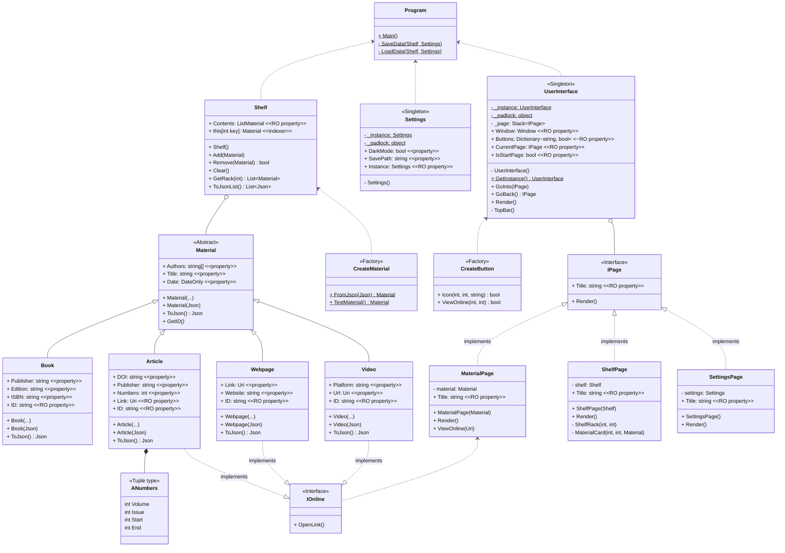

# UML Class Diagram

```mermaid
classDiagram
direction TB

Program <.. Shelf
Program <.. Settings
Program <.. UserInterface


Shelf o-- Material
Shelf <.. CreateMaterial
Material <|-- Book
Material <|-- Article
Material <|-- Video
Material <|-- Webpage

Article *-- ANumbers
Article ..|> IOnline: implements
Webpage ..|> IOnline: implements
Video ..|> IOnline: implements
MaterialPage <.. IOnline

UserInterface <.. CreateButton
UserInterface o-- IPage
IPage <|.. MaterialPage: implements
IPage <|.. ShelfPage: implements
IPage <|.. SettingsPage: implements

class Program {
	+ Main()$
	- SaveData(Shelf, Settings)$
	- LoadData(Shelf, Settings)$
}

%% Interfaces

class IOnline {
	<<Interface>>
	+ OpenLink()
}
class IPage {
	<<Interface>>
	+ Title: string ~~RO property~~
	+ Render()
}

%% Models

class CreateMaterial {
	<<Factory>>
	+ FromJson(Json)$ Material
	+ TestMaterial()$ Material
}
class Settings {
	<<Singleton>>
	- _instance: Settings$
	- _padlock: object$
	+ DarkMode: bool ~~property~~
	+ SavePath: string ~~property~~
	+ Instance: Settings ~~RO property~~
	- Settings()
}
class Shelf {
	+ Contents: ListMaterial ~~RO property~~
	+ this[int key]: Material ~~indexer~~
	+ Shelf()
	+ Add(Material)
	+ Remove(Material) bool
	+ Clear()
	+ GetRack(int) List~Material~
	+ ToJsonList() List~Json~
}
class Material {
	<<Abstract>>
	+ Authors: string[] ~~property~~
	+ Title: string ~~property~~
	+ Date: DateOnly ~~property~~
	+ Material(...)
	+ Material(Json)
	+ ToJson() Json
	+ GetID()*
}
class Book {
	+ Publisher: string ~~property~~
	+ Edition: string ~~property~~
	+ ISBN: string ~~property~~
	+ ID: string ~~RO property~~
	+ Book(...)
	+ Book(Json)
	+ ToJson() Json
}
class Article {
	+ DOI: string ~~property~~
	+ Publisher: string ~~property~~
	+ Numbers: int ~~property~~
	+ Link: Uri ~~RO property~~
	+ ID: string ~~RO property~~
	+ Article(...)
	+ Article(Json)
	+ ToJson() Json
}
class Webpage {
	+ Link: Uri ~~property~~
	+ Website: string ~~property~~
	+ ID: string ~~RO property~~
	+ Webpage(...)
	+ Webpage(Json)
	+ ToJson() Json
}
class Video {
	+ Platform: string ~~property~~
	+ Url: Uri ~~property~~
	+ ID: string ~~RO property~~
	+ Video(...)
	+ Video(Json)
	+ ToJson() Json
}
class ANumbers {
	<<Tuple type>>
	int Volume
	int Issue
	int Start
	int End
}

%% Views

class CreateButton {
	<<Factory>>
	+ Icon(int, int, string) bool
	+ ViewOnline(int, int) bool
}
class UserInterface {
	<<Singleton>>
	- _instance: UserInterface$
	- _padlock: object$
	- _page: Stack~IPage~
	+ Window: Window ~~RO property~~
	+ Buttons: Dictionary~string, bool~ ~~RO property~~
	+ CurrentPage: IPage ~~RO property~~
	+ IsStartPage: bool ~~RO property~~
	- UserInterface()
	+ GetInstance() UserInterface$
	+ GoInto(IPage)
	+ GoBack() IPage
	+ Render()
	- TopBar()
}
class MaterialPage {
	- material: Material
	+ Title: string ~~RO property~~
	+ MaterialPage(Material)
	+ Render()
	+ ViewOnline(Uri)
}
class SettingsPage {
	- settings: Settings
	+ Title: string ~~RO property~~
	+ SettingsPage()
	+ Render()
}
class ShelfPage {
	- shelf: Shelf
	+ Title: string ~~RO property~~
	+ ShelfPage(Shelf)
	+ Render()
	- ShelfRack(int, int)
	- MaterialCard(int, int, Material)
}
```
