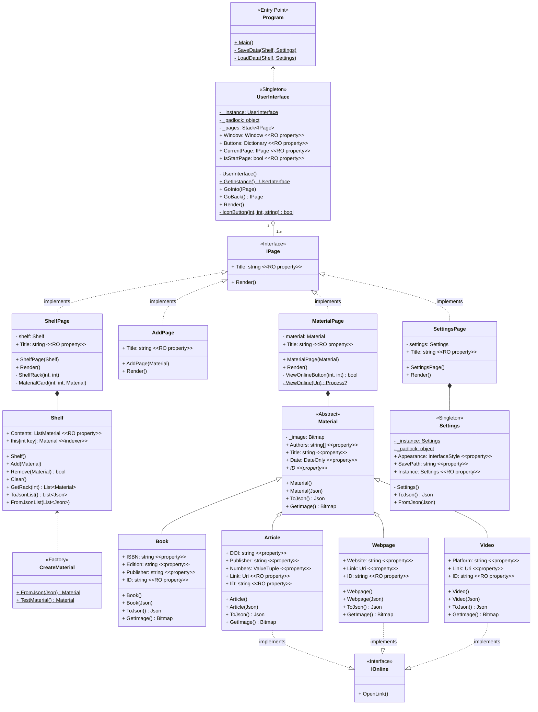

# UML Class Diagram

```mermaid
classDiagram
direction TB

Program <.. UserInterface
Shelf <.. CreateMaterial

Material <|-- Book
Material <|-- Article
Material <|-- Video
Material <|-- Webpage

Article ..|> IOnline: implements
Webpage ..|> IOnline: implements
Video ..|> IOnline: implements

UserInterface "1" o-- "1..n" IPage
IPage <|.. MaterialPage: implements
IPage <|.. AddPage: implements
IPage <|.. ShelfPage: implements
IPage <|.. SettingsPage: implements

MaterialPage *-- Material
SettingsPage *-- Settings
ShelfPage *-- Shelf

class Program {
	<<Entry Point>>
	+ Main()$
	- SaveData(Shelf, Settings)$
	- LoadData(Shelf, Settings)$
}

%% Interfaces

class IOnline {
	<<Interface>>
	+ OpenLink()
}
class IPage {
	<<Interface>>
	+ Title: string ~~RO property~~
	+ Render()
}

%% Models

class CreateMaterial {
	<<Factory>>
	+ FromJson(Json)$ Material
	+ TestMaterial()$ Material
}
class Settings {
	<<Singleton>>
	- _instance: Settings$
	- _padlock: object$
	+ Appearance: InterfaceStyle ~~property~~
	+ SavePath: string ~~property~~
	+ Instance: Settings ~~RO property~~
	- Settings()
	+ ToJson() Json
	+ FromJson(Json)
}
class Shelf {
	+ Contents: ListMaterial ~~RO property~~
	+ this[int key]: Material ~~indexer~~
	+ Shelf()
	+ Add(Material)
	+ Remove(Material) bool
	+ Clear()
	+ GetRack(int) List~Material~
	+ ToJsonList() List~Json~
	+ FromJsonList(List~Json~)
}
class Material {
	<<Abstract>>
	- _image: Bitmap
	+ Authors: string[] ~~property~~
	+ Title: string ~~property~~
	+ Date: DateOnly ~~property~~
	+ ID ~~property~~*
	+ Material()
	+ Material(Json)
	+ ToJson() Json
	+ GetImage() Bitmap
}
class Book {
	+ ISBN: string ~~property~~
	+ Edition: string ~~property~~
	+ Publisher: string ~~property~~
	+ ID: string ~~RO property~~
	+ Book()
	+ Book(Json)
	+ ToJson() Json
	+ GetImage() Bitmap
}
class Article {
	+ DOI: string ~~property~~
	+ Publisher: string ~~property~~
	+ Numbers: ValueTuple ~~property~~
	+ Link: Uri ~~RO property~~
	+ ID: string ~~RO property~~
	+ Article()
	+ Article(Json)
	+ ToJson() Json
	+ GetImage() Bitmap
}
class Webpage {
	+ Website: string ~~property~~
	+ Link: Uri ~~property~~
	+ ID: string ~~RO property~~
	+ Webpage()
	+ Webpage(Json)
	+ ToJson() Json
	+ GetImage() Bitmap
}
class Video {
	+ Platform: string ~~property~~
	+ Link: Uri ~~property~~
	+ ID: string ~~RO property~~
	+ Video()
	+ Video(Json)
	+ ToJson() Json
	+ GetImage() Bitmap
}

%% Views

class UserInterface {
	<<Singleton>>
	- _instance: UserInterface$
	- _padlock: object$
	- _pages: Stack~IPage~
	+ Window: Window ~~RO property~~
	+ Buttons: Dictionary ~~RO property~~
	+ CurrentPage: IPage ~~RO property~~
	+ IsStartPage: bool ~~RO property~~
	- UserInterface()
	+ GetInstance() UserInterface$
	+ GoInto(IPage)
	+ GoBack() IPage
	+ Render()
	- IconButton(int, int, string)$ bool
}
class AddPage {
	+ Title: string ~~RO property~~
	+ AddPage(Material)
	+ Render()
}
class MaterialPage {
	- material: Material
	+ Title: string ~~RO property~~
	+ MaterialPage(Material)
	+ Render()
	- ViewOnlineButton(int, int)$ bool
	- ViewOnline(Uri) Process?$
}
class SettingsPage {
	- settings: Settings
	+ Title: string ~~RO property~~
	+ SettingsPage()
	+ Render()
}
class ShelfPage {
	- shelf: Shelf
	+ Title: string ~~RO property~~
	+ ShelfPage(Shelf)
	+ Render()
	- ShelfRack(int, int)
	- MaterialCard(int, int, Material)
}
```
