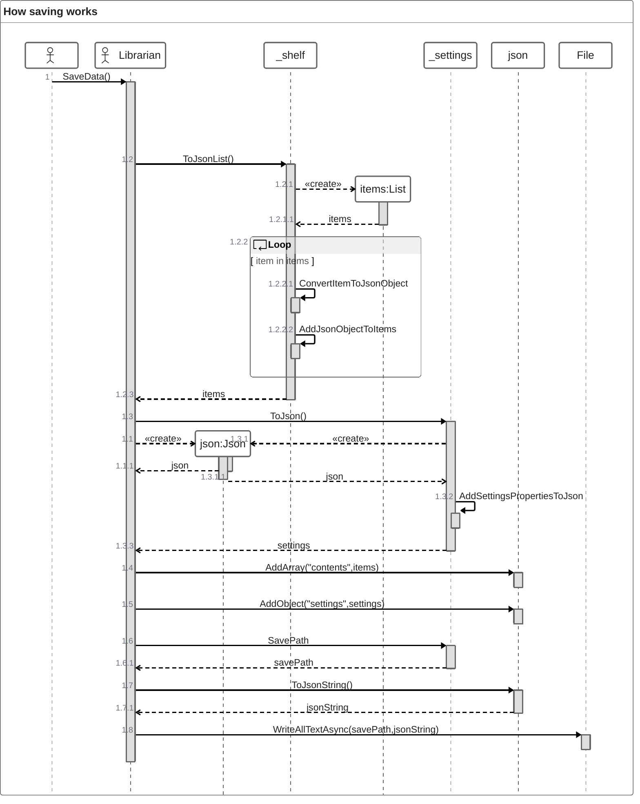

# UML Sequence Diagrams

## How saving works

```mermaid
zenuml

title How saving works
@Actor Librarian

Librarian.SaveData() {
    json = new Json();

    items = _shelf.ToJsonList() {
        items = new List;
        for (item in items) {
            ConvertItemToJsonObject;
            AddJsonObjectToItems;
        }
    }
    settings = _settings.ToJson() {
        json = new Json();
        AddSettingsPropertiesToJson;
    }

    json.AddArray("contents", items);
    json.AddObject("settings", settings);

    savePath = _settings.SavePath;
    jsonString = json.ToJsonString();

    File.WriteAllTextAsync(savePath, jsonString);
}
```
